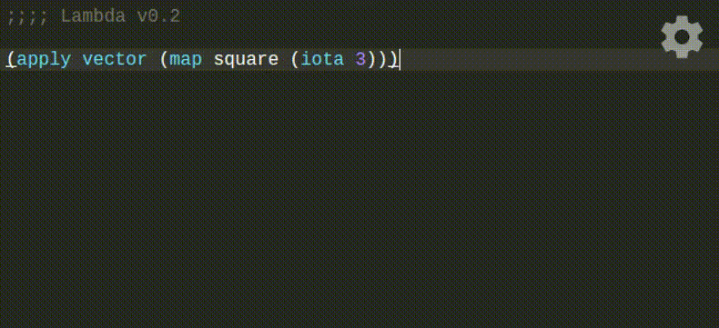
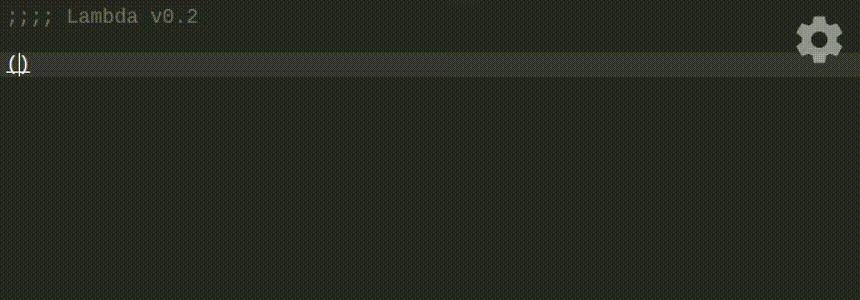

# lambda
Scheme is a beautiful language, but for those afraid of Emacs it can be difficult to use, and things that are difficult to use are difficult to learn.
This project is a modern MIT Scheme environment in the browser that tries its best to be friendly and usable.

## Usage
The editor is a little different than the usual editor/repl split, and is more similar to [LightTable](http://lighttable.com/) or the [Hydrogen plugin](https://atom.io/packages/hydrogen) for Atom than traditional editors. Expressions are evaluated inline and results are printed below each expression.

For example, typing `(apply vector (map square (iota 3)))` in the editor and then evaluating it with `Ctrl-Enter` (or `Cmd-Enter`) will print the commented result `#(0 1 4)` below. But we can also tab between Scheme and TeX representations of results:



You can also do some fun symbolic computing thanks to [scmutils](https://groups.csail.mit.edu/mac/users/gjs/6946/refman.txt):



The help panel summarizes the available keyboard shortcuts and commands - if you're already used to Emacs or Sublime, most of the existing commands should work here as well. And if you're not, great! You don't really need them anyway - just click on the commands in the help panel instead.

## Installation
Things you need:

- [Node.js](https://nodejs.org/en/) v6+
- [schroot](https://wiki.debian.org/Schroot)
- Ubuntu 14.04+ / Debian 8+

It probably works with earlier versions, other \*nixes, and maybe even macOS, but it's never been tried.
If you try to run it on Windows, Gerry Sussman will hunt you down and throw chalk at you.

Things you do:

```
npm install
npm run build
sudo nodejs server/server.js
> socket listening on port 1947
> server listening on port 3000
```

... and it's live on `http://localhost:3000`! Amazing. 

## Notes

### Permissions & Security
Since each Scheme subprocess is sandboxed in a chroot jail, the server needs to be run with sudo permissions so it can write to `/etc/schroot` and manipulate file mounts. There's *probably* a way to get around this (pull requests welcomed) but if it's that concerning you probably shouldn't be doing it anyway - chroot jails are not that secure and you're literally letting strangers on the Internet execute code on your computer. Don't run this publicly on a machine you really care about.

### Authentication
Lambda is designed to support user accounts. There are two authentication modules in `server/authentication/` for [MIT Touchstone](https://ist.mit.edu/touchstone) and [GitHub](https://developer.github.com/v3/), but it's designed to be extensible. Any scheme (ha) you want to implement just has to attach the appropriate routing middleware to the express app, and pass the appropriate username into every new `Connection`. The default is the `null` user, which is a public directory, readable and writable by everyone.

## Credits

None of this would be possible without the incredible work of many free and open-source projects, and none of them get enough thanks:

- [scmutils](https://groups.csail.mit.edu/mac/users/gjs/6946/)
- [CodeMirror](https://github.com/codemirror/CodeMirror)
- [D3.js](https://github.com/d3/d3)
- [Katex](https://github.com/Khan/KaTeX)

And obligatory thanks to Professor Sussman for his indispensable insight and guidance.
